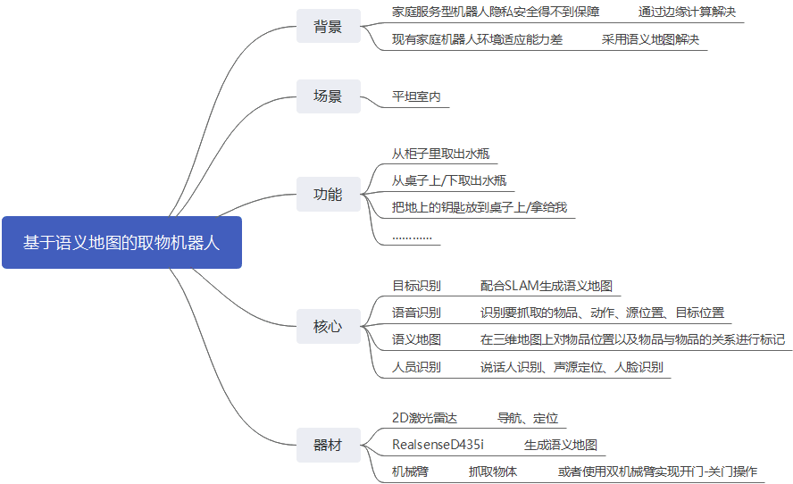

# ESDC项目日志
[项目地址](https://github.com/EIS20172020/ForEis2020)

## 项目管理
- [git操作](./docs/Github.md)
- .gitignore文件模板的[GitHub链接](https://github.com/github/gitignore)

## 日程
- 返校日期：只有天知道
- 项目设计提交ddl：7.24
## 摘要

## 总体方案

## 主要问题

1. 机器人定位
2. 机械臂抓取物品
3. 机械臂抓取范围
4. 语音识别

## 模块设计

### 目标识别
[Yolov3原理](./ObjectDetection/README.md)
#### 进度
- [x] 模型搭建
-  Making VOC data sets and convert to tfrecord
- [ ] 模型训练 
- [ ] 模型搭建
- [ ] 模型部署

### 硬件设计

### 自主定位与导航

机器人导航